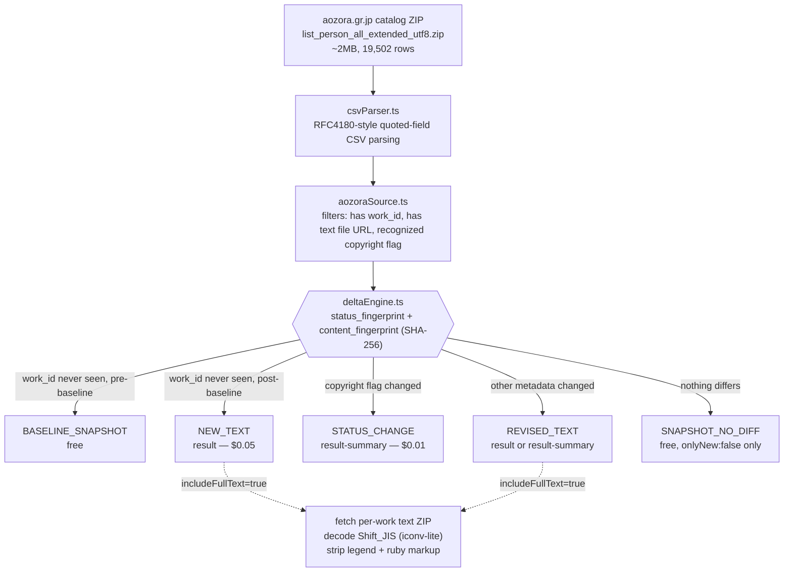

<h1 align="center">Aozora Bunko New Public-Domain Text Delta Feed</h1>
<p align="center"><i>A live delta feed for newly digitized, confirmed-public-domain Japanese literature — not another static snapshot.</i></p>

<p align="center">
  <a href="https://apify.com"></a>
  
  
  <a href="LICENSE"></a>
</p>

<p align="center">
  <a href="https://apify.com/stefano_seggio/aozora-bunko-public-domain-text-feed">
    
  </a>
</p>

<p align="center">
Live and public at <a href="https://apify.com/stefano_seggio/aozora-bunko-public-domain-text-feed">apify.com/stefano_seggio/aozora-bunko-public-domain-text-feed</a>. Owner console: <a href="https://console.apify.com/actors/K0XRDbUteacQL3jeF">console.apify.com/actors/K0XRDbUteacQL3jeF</a>.
</p>

Monitors Aozora Bunko's own official catalog export (青空文庫, Japan's 19,502-row confirmed-public-domain Japanese literature index) for newly digitized or changed works, on whichever schedule you configure via Apify's own Scheduler - there is no fixed built-in cadence.

## What this is

If you're building an NLP corpus, a digital-humanities dataset, or a training pipeline that needs newly digitized, legally confirmed **public-domain Japanese text**, you've probably already found [Aozora Bunko](https://www.aozora.gr.jp/) (青空文庫) — and you've probably also noticed that every Aozora Bunko dataset currently on GitHub or Hugging Face is a static, one-time snapshot frozen at whatever date someone happened to scrape it. This actor is different: it is a **live delta feed**, not a dump. It watches Aozora Bunko's own official catalog export (`list_person_all_extended_utf8.zip`, live-confirmed at 19,502 real rows) on a schedule you control and emits an event only when a work is genuinely new or has actually changed since your last run — never a periodic re-dump of the whole library.

Stop manually re-downloading a 2MB catalog ZIP and diffing it by hand, and stop writing your own Shift_JIS decoder and ruby-annotation stripper, every time you want to check whether Aozora has added anything since your last corpus build. This actor filters to rows carrying Aozora's own confirmed-public-domain flag (`なし`), classifies every row through a dual SHA-256 fingerprint delta engine, and — when you ask for it — fetches, decodes, and cleans the actual work text, delivering both a ruby-gloss-stripped `plain_text` field and the markup-intact `raw_text_with_markup` original.

Every field in the output record traces back to a claim Aozora itself makes in its own catalog: `copyright_status` reflects Aozora's own legal determination under Japan's life-plus-70-year public-domain term, not an independent legal re-derivation of author death dates. That distinction, and the actor's other disclosed limitations, are covered below.

## Architecture



A single global `hasCompletedBaseline` flag guards the cold start — the whole catalog is walked fresh every run, but a first run never floods you with ~18,500 charged `NEW_TEXT` events on day one.

## Real feature set

| Capability | Input field | What it actually does |
|---|---|---|
| Confirmed-public-domain filter | `onlyConfirmedPublicDomain` (default `true`) | Keeps only catalog rows where Aozora's own copyright flag reads `なし` (no copyright); set `false` to also include author-permitted free-use works that are *not* public domain |
| Full-text decoding | `includeFullText` (default `false`) | Downloads the linked per-work text ZIP, decodes Shift_JIS, strips the legend preamble and ruby/annotation markup, embeds `plain_text` + `raw_text_with_markup` |
| Free-vs-paid delta mode | `onlyNew` (default `true`) | `true` pushes only charged `NEW_TEXT`/`REVISED_TEXT`/`STATUS_CHANGE` rows; `false` pushes every filtered row once as an uncharged `SNAPSHOT_NO_DIFF` baseline |
| Author scoping | `authorIdAllowlist` | Restricts monitoring to specific Aozora 人物ID authors instead of the full catalog |
| Per-run spend cap | `maxItemsPerRun` (default `20`, `0` = unlimited) | Caps charged events for a single run, independent of your Apify account spending limit |
| Polite-crawl tuning | `requestDelayMs`, `maxRetries`, `requestTimeoutSecs` | Configurable delay (default 500ms), retry backoff (default 5 attempts), and per-request timeout (default 30s) against a small, unrated, volunteer-run server |
| Independent state namespaces | `deltaStateName` (default `"default"`) | Runs multiple schedules — e.g. different author allowlists — without them draining each other's baseline state |
| State reset | `resetState` (default `false`) | Clears this feed's stored seen-work state before the run, so the next run re-baselines from scratch |
| Dual-fingerprint delta engine | *(internal)* | SHA-256 `status_fingerprint` (copyright flag) and `content_fingerprint` (metadata fields) drive classification; deliberately excludes `content_hash`/`character_count` to avoid false "changed" reclassification |

## Cost & BYOK Disclosure

This actor uses Apify's **Pay-Per-Event (PPE)** pricing model — not a rental — and `Actor.pushData(record, eventName)` performs the charge directly per record pushed.

| Event name | What triggers it | Price |
|---|---|---|
| `result` (Full-Text Delta Delivered) | `NEW_TEXT` or `REVISED_TEXT`, delivered with the decoded full text body attached | $0.05 per event |
| `result-summary` (Metadata-Only Change Summary) | `REVISED_TEXT` (metadata-only) or `STATUS_CHANGE`; also the fallback when a text file fails to fetch/decode | $0.01 per event |
| `BASELINE_SNAPSHOT` / `SNAPSHOT_NO_DIFF` | Only delivered when `onlyNew: false` | Free, never charged |

**Unchanged works are not billed.** Every catalog row gets a pair of SHA-256 fingerprints (`deltaEngine.ts`) — `status_fingerprint` over Aozora's copyright flag, `content_fingerprint` over the row's other metadata. When a work's fingerprint pair matches what's stored from the previous run (`SNAPSHOT_NO_DIFF`), no `result`/`result-summary` event fires — it is suppressed before delivery, not charged and refunded after the fact. Your first baseline run of the whole confirmed-public-domain catalog costs nothing (`onlyNew: false`), and every run after that only ever charges for rows that are actually new or actually changed — a scheduled run that finds nothing new can legitimately cost $0.

**BYOK: none required.** This is pure Pay-Per-Event, not BYOK — you bring no external API key. Aozora Bunko's catalog export and per-work text files are public, unauthenticated resources this actor fetches directly.

## Quickstart

Get an Apify API token from your [Apify Console integrations page](https://console.apify.com/settings/integrations).

### cURL (synchronous, no polling)

```bash
curl -X POST "https://api.apify.com/v2/acts/K0XRDbUteacQL3jeF/run-sync-get-dataset-items?token=<YOUR_API_TOKEN>" \
  -H "Content-Type: application/json" \
  -d '{
  "maxItemsPerRun": 20,
  "onlyConfirmedPublicDomain": true,
  "includeFullText": false
}'
```

### Python (`apify-client`)

```python
# pip install apify-client
import os
from apify_client import ApifyClient

# Reads your Apify API token from the environment - never hardcode it in source.
client = ApifyClient(os.environ["APIFY_API_TOKEN"])

# onlyNew=False requests a free baseline run (SNAPSHOT_NO_DIFF, uncharged);
# includeFullText=True asks for decoded plain_text / raw_text_with_markup.
run_input = {
    "onlyNew": False,
    "onlyConfirmedPublicDomain": True,
    "includeFullText": True,
    "maxItemsPerRun": 25,
}

run = client.actor("stefano_seggio/aozora-bunko-public-domain-text-feed").call(run_input=run_input)
print(f"Run {run['id']} finished with status: {run['status']}")

dataset_items = client.dataset(run["defaultDatasetId"]).list_items().items
print(f"Fetched {len(dataset_items)} dataset item(s):")
for item in dataset_items:
    print(f"- [{item['event_type']}] {item['work_id']}: {item['title']}")
```

### Node.js (`apify-client`)

```javascript
// npm install apify-client
import { ApifyClient } from 'apify-client';

const client = new ApifyClient({ token: process.env.APIFY_API_TOKEN });

// onlyNew:false requests a free baseline run (SNAPSHOT_NO_DIFF, uncharged);
// includeFullText:true asks for decoded plain_text / raw_text_with_markup.
const run = await client.actor('stefano_seggio/aozora-bunko-public-domain-text-feed').call({
    onlyNew: false,
    onlyConfirmedPublicDomain: true,
    includeFullText: true,
    maxItemsPerRun: 25,
});

console.log(`Run ${run.id} finished with status: ${run.status}`);

const { items } = await client.dataset(run.defaultDatasetId).listItems();
console.log(`Fetched ${items.length} dataset item(s):`);
for (const item of items) {
    console.log(`- [${item.event_type}] ${item.work_id}: ${item.title}`);
}
```

Runnable copies of the Python and Node.js examples above (calling the actor by its internal ID rather than its slug) live in `examples/aozora_delta_feed.py` and `examples/aozora-delta-feed.js` in this repo.

## Use this from Claude Desktop, Cursor, or Windsurf (via MCP)

This Actor is also reachable as an MCP server through Apify's own hosted `@apify/actors-mcp-server`, scoped to just this Actor via a `?tools=` query string - not the full Delta Registry fleet.

**Claude Desktop** (via the `mcp-remote` stdio bridge):

```json
{
  "mcpServers": {
    "delta-registry-aozora-bunko-public-domain-text-feed": {
      "command": "npx",
      "args": [
        "-y",
        "mcp-remote",
        "https://mcp.apify.com/?tools=stefano_seggio/aozora-bunko-public-domain-text-feed",
        "--header",
        "Authorization: Bearer ${APIFY_TOKEN}"
      ]
    }
  }
}
```

**Cursor** (native HTTP transport):

```json
{
  "mcpServers": {
    "delta-registry-aozora-bunko-public-domain-text-feed": {
      "url": "https://mcp.apify.com/?tools=stefano_seggio/aozora-bunko-public-domain-text-feed",
      "headers": {
        "Authorization": "Bearer ${APIFY_TOKEN}"
      }
    }
  }
}
```

**Windsurf** (uses `serverUrl`, not `url`):

```json
{
  "mcpServers": {
    "delta-registry-aozora-bunko-public-domain-text-feed": {
      "serverUrl": "https://mcp.apify.com/?tools=stefano_seggio/aozora-bunko-public-domain-text-feed",
      "headers": {
        "Authorization": "Bearer ${env:APIFY_TOKEN}"
      }
    }
  }
}
```

Replace `${APIFY_TOKEN}` with a real token from [Apify Console → Settings → Integrations](https://console.apify.com/settings/integrations). Note that `mcp-remote` does not expand shell environment variables inside the JSON string itself - paste the literal token and keep this file out of version control; Windsurf's `${env:APIFY_TOKEN}` genuinely does resolve from your environment. For the full 28-actor Delta Registry MCP configuration across all three clients, see [MCP_INTEGRATION.md](https://github.com/stefanoseggio/delta-registry-website/blob/main/MCP_INTEGRATION.md).

## Input & Output Schema

This is a documentation/integration wrapper repo with no local `.actor/input_schema.json` - the field list below is the real, complete input surface as documented and exercised in this README's own examples above.

### Input

| Field | Default | Description |
|---|---|---|
| `onlyConfirmedPublicDomain` | `true` | Keeps only catalog rows where Aozora's own copyright flag reads `なし` (no copyright); set `false` to also include author-permitted free-use works that are *not* public domain. |
| `includeFullText` | `false` | Downloads the linked per-work text ZIP, decodes Shift_JIS, strips the legend preamble and ruby/annotation markup, embeds `plain_text` + `raw_text_with_markup`. |
| `onlyNew` | `true` | `true` pushes only charged `NEW_TEXT`/`REVISED_TEXT`/`STATUS_CHANGE` rows; `false` pushes every filtered row once as an uncharged `SNAPSHOT_NO_DIFF` baseline. |
| `authorIdAllowlist` | - | Restricts monitoring to specific Aozora 人物ID authors instead of the full catalog. |
| `maxItemsPerRun` | `20` (`0` = unlimited) | Caps charged events for a single run, independent of your Apify account spending limit. |
| `requestDelayMs` / `maxRetries` / `requestTimeoutSecs` | `500` / `5` / `30` | Polite-crawl tuning against a small, unrated, volunteer-run server. |
| `deltaStateName` | `"default"` | Namespaces baseline state, so multiple schedules (e.g. different author allowlists) don't drain each other's state. |
| `resetState` | `false` | Clears this feed's stored seen-work state before the run, so the next run re-baselines from scratch. |

### Output

Each dataset row is one delta event: `event_type` (`BASELINE_SNAPSHOT` / `NEW_TEXT` / `REVISED_TEXT` / `STATUS_CHANGE` / `SNAPSHOT_NO_DIFF`), Aozora's own `work_id`/`title`/`author_name`, `copyright_status`, and — when full text was fetched — `character_count`, `content_hash`, `plain_text`, and `raw_text_with_markup`.

#### Sample Extracted Dataset (JSON)

One real record from this Actor's own dataset, matching `.actor/dataset_schema.json`:

```json
{
  "record_id": "000148-056",
  "event_type": "NEW_TEXT",
  "scraped_at": "2026-09-15T14:28:00.000Z",
  "is_new": true,
  "source_url": "https://www.aozora.gr.jp/cards/000148/card056.html",
  "work_id": "000148-056",
  "title": "荧子",
  "author_name": "夕鮯洋子",
  "copyright_status": "confirmed_public_domain",
  "character_count": 18420,
  "content_hash": "c9d3e6b47058a1c4e9f2b5d8a1c4e7f0b3d8f2a1"
}
```

#### Field reference

| Field | Description |
|---|---|
| `record_id` | Same as `work_id` - Aozora's own stable work identifier. |
| `event_type` | `BASELINE_SNAPSHOT`, `NEW_TEXT`, `REVISED_TEXT`, `STATUS_CHANGE`, or `SNAPSHOT_NO_DIFF`. |
| `scraped_at` | ISO-8601 timestamp of this run. |
| `is_new` | `true` if this `work_id` has never been seen before. |
| `source_url` | The work's own Aozora Bunko card page. |
| `work_id` | Aozora's stable work identifier (`<person_id>-<work_no>`). |
| `title` / `author_name` | The work's title and author, as published by Aozora. |
| `copyright_status` | Aozora's own copyright determination, e.g. `confirmed_public_domain`. |
| `character_count` | Character count of the decoded work text (present when `includeFullText: true`). |
| `content_hash` | Hash of the decoded work text, used to detect a `REVISED_TEXT` re-publication (present when `includeFullText: true`). |
| `plain_text` / `raw_text_with_markup` | Ruby-gloss-stripped plain text and the markup-intact original (present when `includeFullText: true`; omitted from the summary sample above for brevity). |

Additional fields present in `.actor/dataset_schema.json` but not shown above: `event_id` (idempotency key), `author_id` (Aozora 人物ID), `first_published_date`, `source_last_updated`, `text_file_url` / `xhtml_file_url` (Aozora's own source file links), `changed_fields` (populated on `REVISED_TEXT`), and the `status_fingerprint` / `content_fingerprint` SHA-256 hashes described under Real feature set above.

## Known limitations, disclosed rather than hidden

- **Freshness ceiling is real and external** — this feed can never report a new or revised text faster than Aozora's own volunteer digitization/proofreading process produces one.
- **Low, possibly near-zero event volume by design** — many scheduled runs may emit zero chargeable events; that is correct behavior, not a bug.
- **Text-decoding brittleness is real** — Aozora's per-work Shift_JIS + ruby-markup convention has no confirmed independent mirror; a file that fails to decode degrades to a metadata-only record rather than failing the run.
- **`copyright_status` trusts Aozora's own vetting**, not an independent legal re-derivation of author death dates.
- **Single point of failure** — this actor depends on one file at one URL published by one small, non-commercial organization with no SLA of its own.

## Why not just scrape it yourself

- **Zero infrastructure** — no server, cron job, or CSV diffing script to host and maintain; runs on Apify's managed platform on whatever schedule you set.
- **No proxy or rate-limit babysitting** — request delay, retry count, and timeout are already tuned (defaults: 500ms delay, 5 retries with backoff, 30s timeout) to be a polite citizen of a small, unrated, non-commercial server, out of the box.
- **Built-in delta/cross-run change detection** — the dual SHA-256 fingerprint engine means you see only genuinely new or changed rows, instead of re-parsing and re-diffing all 19,502 catalog rows yourself on every run.
- **Managed state, no cold-start flood** — seen-work state persists automatically in a named Key-Value store; the `hasCompletedBaseline` gate stops a first run from dumping ~18,500 charged events on you by surprise.

## Contributing & Local Setup

As disclosed below, this repository is a documentation and integration wrapper — the actor's real CSV-parsing/decoding/delta-engine TypeScript source (`csvParser.ts`, `aozoraSource.ts`, `deltaEngine.ts`) is proprietary and runs privately on Apify's platform, not checked into this repository. There is no `src/` here to clone and hack on.

That means useful contributions here are: improving this README, fixing or extending the Node.js/Python examples in [`examples/`](examples), or reporting a documentation error via a GitHub issue or PR on this repo. To report a bug in the actor's actual behavior, request author-scoping or decoding improvements, or ask a product question, use the Apify Store's own Issues tab on the [Store listing](https://apify.com/stefano_seggio/aozora-bunko-public-domain-text-feed) — that's where the actor's real maintainer (also the author of this repo) triages requests against the live source.

## License

The code, configuration, and documentation in this repository are licensed under MIT (see [`LICENSE`](LICENSE)) — this covers the wrapper/documentation content only. The actor's own implementation running on Apify Console is proprietary and not included in this repository.

---

## About Delta Registry

This actor is part of **Delta Registry** — pay-per-event regulatory & compliance data infrastructure built and operated by Stefano Seggio — extended here into public-domain text and digital-humanities delta feeds under the same delta-engine/PPE conventions used across the rest of the fleet. For professional inquiries or enterprise licensing, connect on [LinkedIn](https://www.linkedin.com/in/stefanoseggio-deltaregistry). Browse the rest of the fleet at [github.com/stefanoseggio](https://github.com/stefanoseggio).
