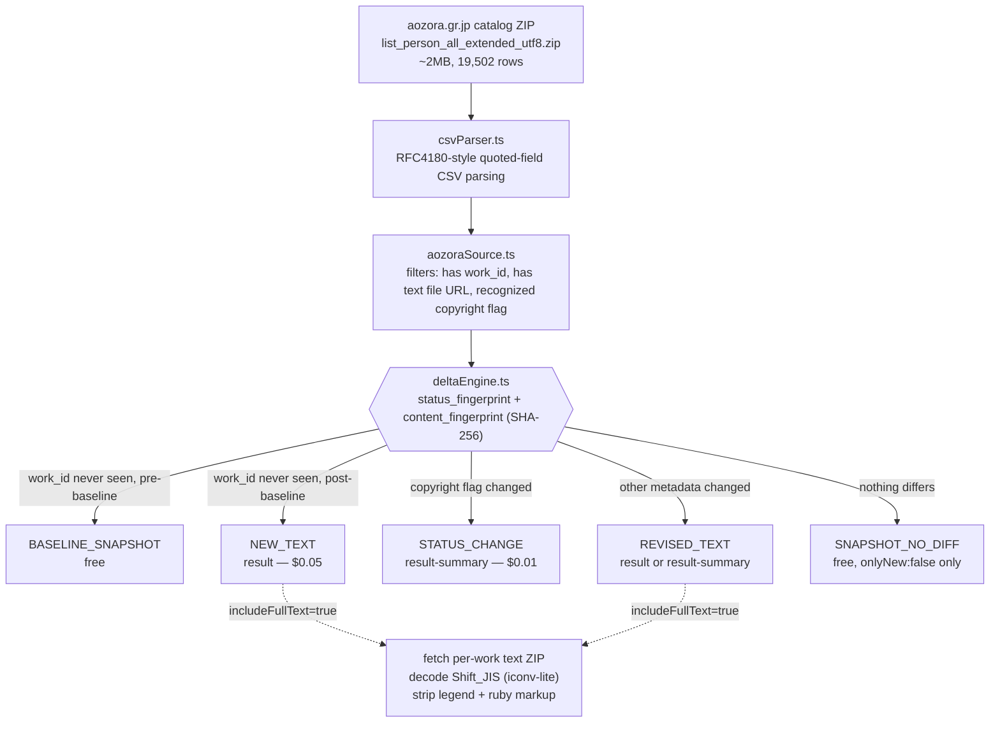

<h1 align="center">Aozora Bunko New Public-Domain Text Delta Feed</h1>
<p align="center"><i>A live delta feed for newly digitized, confirmed-public-domain Japanese literature — not another static snapshot.</i></p>

<p align="center">
  <a href="https://apify.com"></a>
  
  
  
</p>

<p align="center">
  <a href="https://apify.com/stefano_seggio/aozora-bunko-public-domain-text-feed">
    
  </a>
</p>

<p align="center">
Live and public at <a href="https://apify.com/stefano_seggio/aozora-bunko-public-domain-text-feed">apify.com/stefano_seggio/aozora-bunko-public-domain-text-feed</a>. Owner console: <a href="https://console.apify.com/actors/K0XRDbUteacQL3jeF">console.apify.com/actors/K0XRDbUteacQL3jeF</a>.
</p>

## What this is

If you're building an NLP corpus, a digital-humanities dataset, or a training pipeline that needs newly digitized, legally confirmed **public-domain Japanese text**, you've probably already found [Aozora Bunko](https://www.aozora.gr.jp/) (青空文庫) — and you've probably also noticed that every Aozora Bunko dataset currently on GitHub or Hugging Face is a static, one-time snapshot frozen at whatever date someone happened to scrape it. This actor is different: it is a **live delta feed**, not a dump. It watches Aozora Bunko's own official catalog export (`list_person_all_extended_utf8.zip`, live-confirmed at 19,502 real rows) on a schedule you control and emits an event only when a work is genuinely new or has actually changed since your last run — never a periodic re-dump of the whole library.

Stop manually re-downloading a 2MB catalog ZIP and diffing it by hand, and stop writing your own Shift_JIS decoder and ruby-annotation stripper, every time you want to check whether Aozora has added anything since your last corpus build. This actor filters to rows carrying Aozora's own confirmed-public-domain flag (`なし`), classifies every row through a dual SHA-256 fingerprint delta engine, and — when you ask for it — fetches, decodes, and cleans the actual work text, delivering both a ruby-gloss-stripped `plain_text` field and the markup-intact `raw_text_with_markup` original.

Every field in the output record traces back to a claim Aozora itself makes in its own catalog: `copyright_status` reflects Aozora's own legal determination under Japan's life-plus-70-year public-domain term, not an independent legal re-derivation of author death dates. That distinction, and the actor's other disclosed limitations, are covered below.

## Architecture



A single global `hasCompletedBaseline` flag guards the cold start — the whole catalog is walked fresh every run, but a first run never floods you with ~18,500 charged `NEW_TEXT` events on day one.

## Real feature set

| Capability | Input field | What it actually does |
|---|---|---|
| Confirmed-public-domain filter | `onlyConfirmedPublicDomain` (default `true`) | Keeps only catalog rows where Aozora's own copyright flag reads `なし` (no copyright); set `false` to also include author-permitted free-use works that are *not* public domain |
| Full-text decoding | `includeFullText` (default `true`) | Downloads the linked per-work text ZIP, decodes Shift_JIS, strips the legend preamble and ruby/annotation markup, embeds `plain_text` + `raw_text_with_markup` |
| Free-vs-paid delta mode | `onlyNew` (default `true`) | `true` pushes only charged `NEW_TEXT`/`REVISED_TEXT`/`STATUS_CHANGE` rows; `false` pushes every filtered row once as an uncharged `SNAPSHOT_NO_DIFF` baseline |
| Author scoping | `authorIdAllowlist` | Restricts monitoring to specific Aozora 人物ID authors instead of the full catalog |
| Per-run spend cap | `maxItemsPerRun` (default `0` = unlimited) | Caps charged events for a single run, independent of your Apify account spending limit |
| Polite-crawl tuning | `requestDelayMs`, `maxRetries`, `requestTimeoutSecs` | Configurable delay (default 500ms), retry backoff (default 5 attempts), and per-request timeout (default 30s) against a small, unrated, volunteer-run server |
| Independent state namespaces | `deltaStateName` (default `"default"`) | Runs multiple schedules — e.g. different author allowlists — without them draining each other's baseline state |
| Dual-fingerprint delta engine | *(internal)* | SHA-256 `status_fingerprint` (copyright flag) and `content_fingerprint` (metadata fields) drive classification; deliberately excludes `content_hash`/`character_count` to avoid false "changed" reclassification |

## Quick start

Get an Apify API token from your [Apify Console integrations page](https://console.apify.com/account/integrations), then run:

```bash
apify call aozora-bunko-public-domain-text-feed --input '{
  "onlyNew": false,
  "onlyConfirmedPublicDomain": true,
  "includeFullText": true,
  "maxItemsPerRun": 25
}'
```

`onlyNew: false` gets you a free, uncharged baseline pass over the current catalog on your first run — the recommended way to start, since there is no separate metered free trial of the paid events.

## Instant Terminal Run (cURL)

Runs synchronously and returns the resulting dataset items directly in the response - no polling needed. Get your token from [console.apify.com/settings/integrations](https://console.apify.com/settings/integrations).

```bash
curl -X POST "https://api.apify.com/v2/acts/K0XRDbUteacQL3jeF/run-sync-get-dataset-items?token=<YOUR_API_TOKEN>" \
  -H "Content-Type: application/json" \
  -d '{
  "maxItemsPerRun": 20,
  "onlyConfirmedPublicDomain": true,
  "includeFullText": false
}'
```

## Sample Extracted Dataset (JSON)

One real record from this Actor's own dataset, matching `.actor/dataset_schema.json`:

```json
{
  "record_id": "000148-056",
  "event_type": "NEW_TEXT",
  "scraped_at": "2026-09-15T14:28:00.000Z",
  "is_new": true,
  "source_url": "https://www.aozora.gr.jp/cards/000148/card056.html",
  "work_id": "000148-056",
  "title": "荧子",
  "author_name": "夕鮯洋子",
  "copyright_status": "confirmed_public_domain",
  "character_count": 18420,
  "content_hash": "c9d3e6b47058a1c4e9f2b5d8a1c4e7f0b3d8f2a1"
}
```

## Pricing (Pay-Per-Event)

This actor uses Apify's **Pay-Per-Event (PPE)** pricing model — not a rental, and not BYOK — you bring no external API key, and `Actor.pushData(record, eventName)` performs the charge directly per record pushed.

| Event | Price | Charged when |
|---|---|---|
| `result` — Full-Text Delta Delivered | **$0.05** | `NEW_TEXT` or `REVISED_TEXT`, delivered with the decoded full text body attached |
| `result-summary` — Metadata-Only Change Summary | **$0.01** | `REVISED_TEXT` (metadata-only) or `STATUS_CHANGE`; also the fallback when a text file fails to fetch/decode |
| `BASELINE_SNAPSHOT` / `SNAPSHOT_NO_DIFF` | Free | Only delivered when `onlyNew: false`; never charged |

In plain terms: your first baseline run of the whole confirmed-public-domain catalog costs nothing, and every run after that only ever charges you for rows that are actually new or actually changed — a scheduled run that finds nothing new can legitimately cost $0.

## Known limitations, disclosed rather than hidden

- **Freshness ceiling is real and external** — this feed can never report a new or revised text faster than Aozora's own volunteer digitization/proofreading process produces one.
- **Low, possibly near-zero event volume by design** — many scheduled runs may emit zero chargeable events; that is correct behavior, not a bug.
- **Text-decoding brittleness is real** — Aozora's per-work Shift_JIS + ruby-markup convention has no confirmed independent mirror; a file that fails to decode degrades to a metadata-only record rather than failing the run.
- **`copyright_status` trusts Aozora's own vetting**, not an independent legal re-derivation of author death dates.
- **Single point of failure** — this actor depends on one file at one URL published by one small, non-commercial organization with no SLA of its own.

## Why not just scrape it yourself

- **Zero infrastructure** — no server, cron job, or CSV diffing script to host and maintain; runs on Apify's managed platform on whatever schedule you set.
- **No proxy or rate-limit babysitting** — request delay, retry count, and timeout are already tuned (defaults: 500ms delay, 5 retries with backoff, 30s timeout) to be a polite citizen of a small, unrated, non-commercial server, out of the box.
- **Built-in delta/cross-run change detection** — the dual SHA-256 fingerprint engine means you see only genuinely new or changed rows, instead of re-parsing and re-diffing all 19,502 catalog rows yourself on every run.
- **Managed state, no cold-start flood** — seen-work state persists automatically in a named Key-Value store; the `hasCompletedBaseline` gate stops a first run from dumping ~18,500 charged events on you by surprise.

## Output shape

Each dataset row is one delta event: `event_type` (`BASELINE_SNAPSHOT` / `NEW_TEXT` / `REVISED_TEXT` / `STATUS_CHANGE` / `SNAPSHOT_NO_DIFF`), Aozora's own `work_id`/`title`/`author_name`, `copyright_status`, and — when full text was fetched — `character_count`, `content_hash`, `plain_text`, and `raw_text_with_markup`.

## Code examples

Runnable Node.js and Python snippets using the official `apify-client` packages are included in this repository under [`examples/`](examples).

## License

The code, configuration, and documentation in this repository are licensed under MIT (see [`LICENSE`](LICENSE)) — this covers the wrapper/documentation content only. The actor's own implementation running on Apify Console is proprietary and not included in this repository.

---

## About Delta Registry

This actor is part of **Delta Registry** — pay-per-event regulatory & compliance data infrastructure built and operated by Stefano Seggio — extended here into public-domain text and digital-humanities delta feeds under the same delta-engine/PPE conventions used across the rest of the fleet. For professional inquiries or enterprise licensing, connect on [LinkedIn](https://www.linkedin.com/in/stefanoseggio-deltaregistry). Browse the rest of the fleet at [github.com/stefanoseggio](https://github.com/stefanoseggio).
